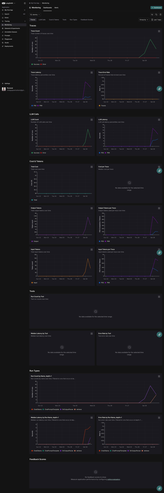
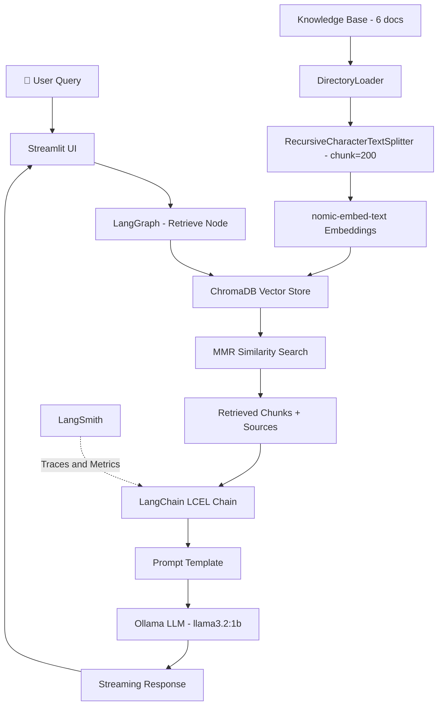

# 🚗 BMW Customer Service RAG Chatbot


> AI-powered chatbot for BMW Group customer journey analytics — built with LangChain, LangGraph, ChromaDB, Ollama, and Streamlit.

---

## Observability — LangSmith



---

## Overview

This project is a prototype of a local AI-powered chatbot that answers customer questions based on a provided knowledge base. It uses **Retrieval-Augmented Generation (RAG)** to find relevant documents and generate natural language answers — without hallucinating information that isn't in the knowledge base.

---

## Architecture



---

## Tech Stack

| Component | Technology | Why |
|---|---|---|
| **LLM** | Ollama `llama3.2:1b` | Lightweight, CPU-friendly, no API key needed |
| **Embeddings** | Ollama `nomic-embed-text` | Best quality/speed tradeoff for local embedding |
| **Vector Store** | ChromaDB | Local, persistent, native LangChain integration |
| **Framework** | LangChain LCEL | Composable, each step traceable in LangSmith |
| **Orchestration** | LangGraph | Modular, extensible, production-ready pattern |
| **UI** | Streamlit | Fast to build, interactive, easy to demo |
| **Observability** | LangSmith | Per-step latency, token usage, trace visualization |

---

## Project Structure

```
bmw-ai-engineer-case-study/
│
├── data/
│   ├── knowledge_base/          # 6 provided .txt documents
│   │   ├── doc_01_vehicle_features.txt
│   │   ├── doc_02_service_maintenance.txt
│   │   ├── doc_03_warranty.txt
│   │   ├── doc_04_ordering_process.txt
│   │   ├── doc_05_electric_vehicles.txt
│   │   └── doc_06_customer_support.txt
│   └── chroma_db/               # auto-generated vector store
│
├── src/
│   ├── ingestion.py             # document loading, chunking, ChromaDB setup
│   ├── pipeline.py              # retriever, prompt template, LCEL chain
│   ├── graph.py                 # LangGraph retrieval node
│   └── app.py                   # Streamlit chat interface
│
├── assets/                      # screenshots and demo GIF
│   └── langsmith.png
│
├── .env.example                 # environment variables template
├── requirements.txt
└── README.md
```

---

## Setup Instructions

### Prerequisites
- Python 3.10+
- [Ollama](https://ollama.ai) installed and running

### 1. Clone the repository
```bash
git clone https://github.com/SHUBHAM-max449/bmw-ai-engineer-case-study.git
cd bmw-ai-engineer-case-study
```

### 2. Create virtual environment
```bash
python -m venv venv
source venv/bin/activate        # Mac/Linux
# venv\Scripts\activate         # Windows
```

### 3. Install dependencies
```bash
pip install -r requirements.txt
```

### 4. Pull Ollama models
```bash
ollama pull llama3.2:1b
ollama pull nomic-embed-text
```

### 5. Set up environment variables
```bash
cp .env.example .env
```
Edit `.env` and add your LangSmith API key:
```
LANGCHAIN_TRACING_V2=true
LANGCHAIN_ENDPOINT=https://api.smith.langchain.com
LANGCHAIN_API_KEY=your_api_key_here
LANGCHAIN_PROJECT=bmw-rag-chatbot
```

### 6. Run the app
```bash
streamlit run src/app.py
```

The vector store is built automatically on first run. Subsequent runs load the existing ChromaDB directly.

---

## Key Technical Decisions

### Chunking Strategy
- `chunk_size=200`, `chunk_overlap=20`
- Documents are small (~1000 chars each) — chunk_size=500 caused duplicate retrieval
- Smaller chunks give more precise retrieval with less redundancy

### Retrieval Strategy
- **MMR (Maximal Marginal Relevance)** over plain similarity search
- MMR reduces redundant chunks by balancing relevance and diversity
- `fetch_k=20` candidates → selects best `top_k` diverse chunks

### Model Selection
- `llama3.2:1b` — best latency/quality tradeoff for local CPU inference
- Benchmarked against `tinyllama` using LangSmith traces

### LangGraph
- Wraps retrieval in a stateful graph node
- Makes pipeline modular — easy to add query rewriting, guardrails, or routing nodes
- Each node independently traceable in LangSmith

---

## Benchmarking Results

Model and parameter selection was data-driven using LangSmith observability:

| Step | Change | Result |
|---|---|---|
| 1 | Baseline: tinyllama, similarity, chunk=500 | High latency, duplicate chunks |
| 2 | Model: llama3.2:1b | Better answer quality |
| 3 | Retriever: similarity → MMR | Less duplicate chunks |
| 4 | Chunk size: 500 → 200 | Better retrieval precision |
| 5 | num_predict: unlimited → 200 | Faster generation |
| 6 | Top-K: 5 → 3 | Optimal context size |

---

## Roadmap

**Short term:**
- Add query rewriting node in LangGraph
- Add guardrails node to filter irrelevant questions
- Improve UI with retrieved context visualization

**Production:**
- Replace Ollama with cloud-hosted model (GPT-4o, Claude)
- Replace ChromaDB with Pinecone or Weaviate for scale
- Add authentication and multi-user support
- Deploy on AWS/GCP with auto-scaling
- Self-hosted LangSmith for full observability

---

## Problems Faced & Solutions

| Problem | Solution |
|---|---|
| LangSmith 401/403 errors | Must set `os.environ` before LangChain imports |
| LangGraph + streaming conflict | Used LangGraph for retrieval only, streamed generation separately |
| Duplicate chunks in retrieval | Switched to MMR + reduced chunk size to 200 |
| ChromaDB rebuilding on every run | Added `os.path.exists()` check before rebuilding |
| High latency on local CPU | Reduced `num_predict=200`, lowered `top_k` giving better result |

---

## License

This project was built as part of a technical case study for BMW Group.